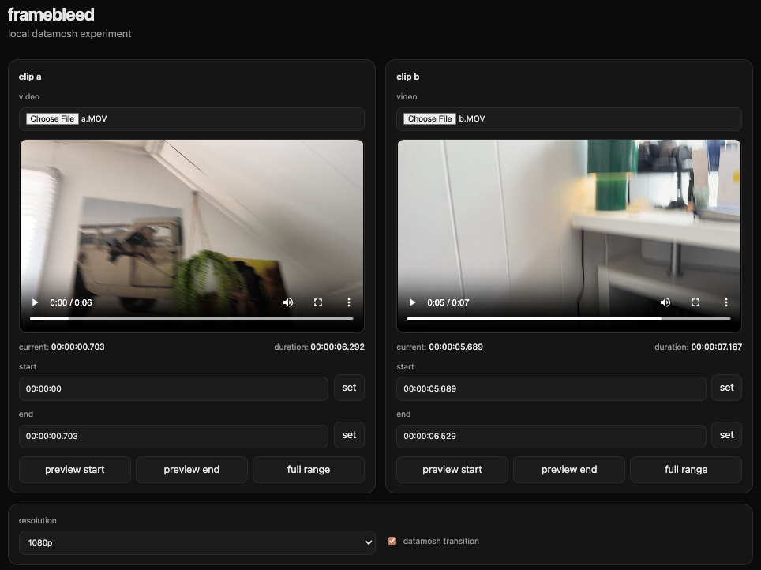
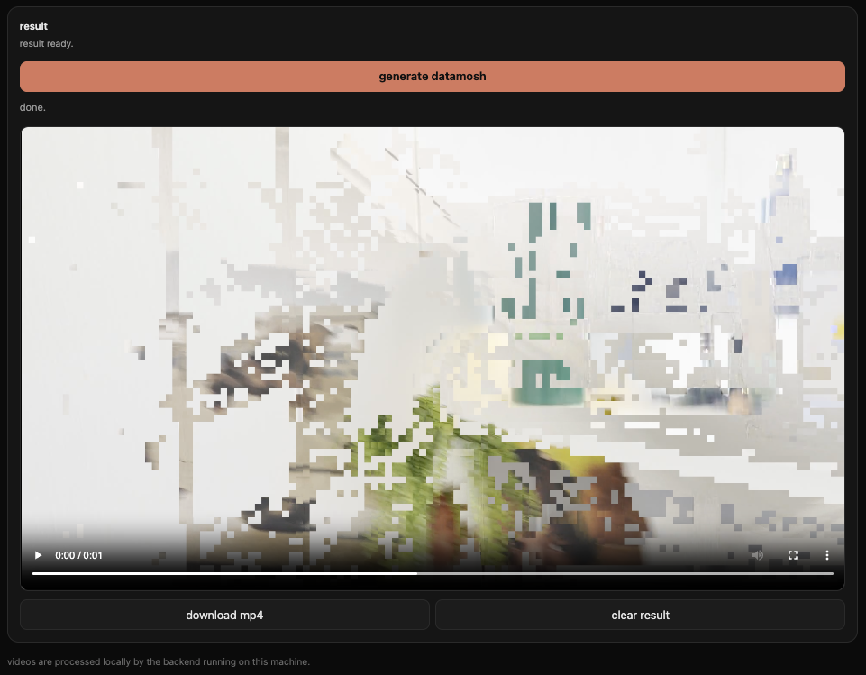

# framebleed

framebleed is an experimental local-first datamosh tool for creating glitch transitions between two video clips.

it runs as a local web app: you choose two clips, preview them in the browser, set start/end points, generate a datamoshed transition, and export the result as an mp4.

## screenshots





## status

experimental, but working.

currently supports:

- local web ui
- two-clip upload
- browser preview for both clips
- custom start/end points
- current time and duration display
- selected start/end preview controls
- clean stitched exports
- datamoshed transition exports
- mp4 output preview/download
- backend time validation
- frontend time validation
- generated job cleanup
- per-job working folders

## requirements

- python 3
- ffmpeg
- ffprobe

on macos:

```bash
brew install ffmpeg
```

## setup

create and activate a virtual environment:

```bash
python3 -m venv .venv
source .venv/bin/activate
```

install dependencies:

```bash
python3 -m pip install -r requirements.txt
```

## run

start the local app:

```bash
python3 run.py
```

the app opens at:

```txt
http://127.0.0.1:8000
```

you can also run the backend directly:

```bash
uvicorn app.main:app --reload
```

the app runs locally. videos are processed on your machine.

## usage

1. choose clip a
2. choose clip b
3. preview both clips
4. set start/end points for each clip
5. generate the datamosh transition
6. preview or download the mp4

## cli

the core engine can also be run directly from the command line.

clean export:

```bash
python3 mosh.py \
  --clip-a input/a.MOV \
  --clip-b input/b.MOV \
  --a-start 00:00:00 \
  --a-end 00:00:03 \
  --b-start 00:00:00 \
  --b-end 00:00:03 \
  --resolution 1080p \
  --output output/clean_test.mp4
```

datamosh export:

```bash
python3 mosh.py \
  --clip-a input/a.MOV \
  --clip-b input/b.MOV \
  --a-start 00:00:00 \
  --a-end 00:00:03 \
  --b-start 00:00:00 \
  --b-end 00:00:03 \
  --resolution 1080p \
  --output output/mosh_test.mp4 \
  --mosh
```

custom working directory:

```bash
python3 mosh.py \
  --clip-a input/a.MOV \
  --clip-b input/b.MOV \
  --a-start 00:00:01 \
  --a-end 00:00:04 \
  --b-start 00:00:01 \
  --b-end 00:00:04 \
  --resolution 1080p \
  --output output/custom_mosh.mp4 \
  --working-dir working/custom-job \
  --mosh
```

## project structure

```txt
app/
  __init__.py
  main.py
  static/
    app.js
    index.html
    styles.css

assets/
  framebleed_ui1.png
  framebleed_ui2.png

input/
  .gitkeep

output/
  .gitkeep

uploads/
  .gitkeep

working/
  .gitkeep

mosh.py
requirements.txt
run.py
```

## how it works

framebleed uses ffmpeg to trim and normalize both clips into temporary avi files.

for datamosh exports, it identifies the transition i-frame between clip a and clip b, removes a small window around that transition frame, then re-exports the result as an mp4.

temporary files are stored in per-job folders under:

```txt
uploads/
output/
working/
```

generated media and temporary files are ignored by git.

## cleanup

the backend includes a cleanup endpoint for generated job folders:

```txt
http://127.0.0.1:8000/docs
```

from there, run:

```txt
post /cleanup
```

this removes generated job folders from:

```txt
uploads/
output/
working/
```

while keeping the tracked `.gitkeep` files.

## security / privacy

framebleed is designed to run locally. uploaded clips are saved and processed on your own machine.

do not deploy this publicly without adding upload limits, rate limiting, authentication, job timeouts, and stronger cleanup/sandboxing.

## notes

this is still experimental.

the current focus is a clean local workflow for creating two-clip datamosh transitions. future work may include better timeline controls, cleaner result management, stronger datamosh controls, and packaging for easier local installation.

## license

mit
